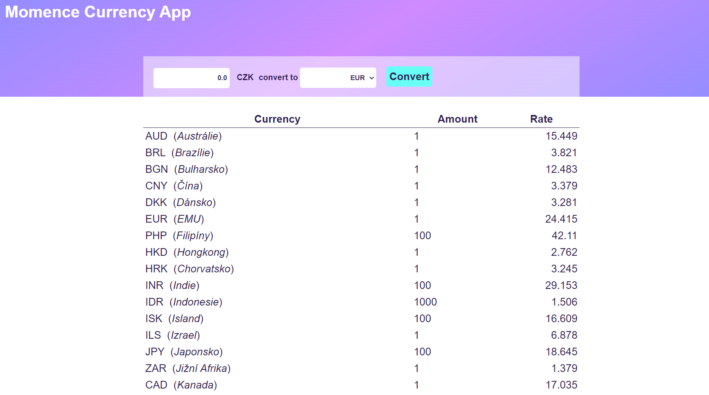

# Momence Currency App

1. Po svém startu stáhne aktuální kurzovní lístek z webu České Národní Banky.
   API URL: http://www.cnb.cz/cs/financni_trhy/devizovy_trh/kurzy_devizoveho_trhu/denni_kurz.txt
   Dokumentace: https://www.cnb.cz/cs/casto-kladene-dotazy/Kurzy-devizoveho-trhu-na-www-strankach-CNB/
2. Stažená data zpracuje a přehledně zobrazí uživateli.
3. Připoj jednoduchý formulář, do kterého uživatel zadá částku v CZK a po stisknutí tlačítka mu zobrazí přepočet na jím zvolenou měnu s využitím aktuálního kurzu.
4. Kód commituj průběžně. Výsledek nahraj na GitHub nebo jiné úložiště.
5. Tech. stack - React (+ Hooks), TypeScript, Styled Components, React Query

## Result

